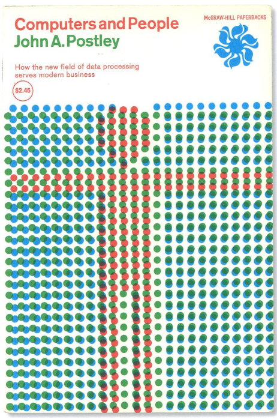
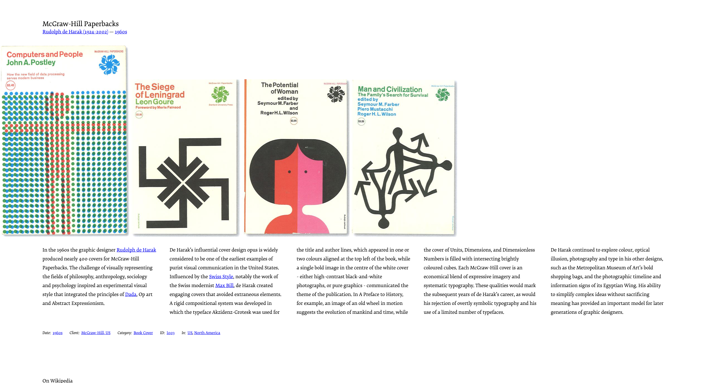

# web-animaties-19-20

Repo voor de opdracht van Web Animaties van de Minor Visual Interface Design.

## Inleiding

Bij de *Minor Visual Interface Design* aan de Hogeschool van Amsterdam werd ons gevraagd om voor het vak *Web Animaties* een kunstwerk naar keuze te animeren door middel van HTML/CSS en Javascript.

## Het kunstwerk
Het kunstwerk dat ik gekozen heb is een tijdschrift/book cover door de kunstenaar *Rudolph de Harak.* Rudolph heeft in de jaren 60 bijna 400 covers ontworpen voor McGraw-Hill. Om de boodschap van onder andere de filosofie, psychologie en sociologie te dekken heeft hij gekozen voor de stijlen uit de stromingen: Dada, Pop art en abstract expressionisme. Dit geeft de cover een unieke en eigentijdse uitstraling.

## Waarom dit kunstwerk

Dit eigentijdse is dan ook de reden dat ik dit kunstwerk gekozen heb. De combinatie van de retro kleuren en het tijdloze lettertype trokken mij erg aan. Ook kreeg ik al meteen inspiratie bij het zien van de **dots**.

## De animaties
[Link naar de uitwerking op github:](https://grootrob.github.io/web-animaties-19-20/)

In de uitwerking van het kunstwerk zitten verschillende interacties verwerkt.

#### Desktop:
- Zodra je op de pagina komt zal je zien dat deze de volledige breedte van het scherm benut met de bolletjes. Dit heb ik gedaan ondanks dat het origineel portrait was.
- Ook is te zien dat de bolletjes bewegen over elkaar heen. Door de **multiply blend mode** veranderen ze daardoor van kleur.
- Door op de bolletjes te klikken zullen deze van kleur veranderen met een **Invert.**
- Ook zit er een **Hover** op de "wieltje" hier zit een subtiele rotatie onder met een *cubic brezier.*
- Door op een toets te drukken van het toetsenbord zal de "morderne modus" geactiveerd worden. De kleuren veranderen van RGB naar CMYK. Dit maakt het retro kunstwerk ineens erg modern.

#### Mobiel:
- Op mobiel is de hover op het "wieltje" aangepast naar een click omdat je op een touchdevice niet kan hoveren.
- Ook zal je zien dat de "press any key for modern" is veranderd in "click to toggle modern" nu zal de moderne modus geactiveerd worden als je op deze button klikt.
